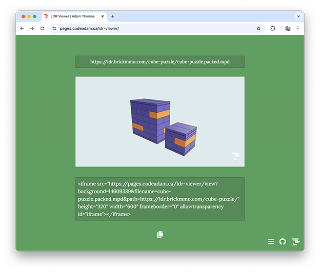

# Embed an Interactive LDR File on Your Web Page

A basic tool to display an interactive LDR file using Three.js and an `iframe`. 

> The active version can viewed at:  
> https://pages.codeadam.ca/ldr-viewer

---

## Repo Resources

- [Visual Studio Code](https://code.visualstudio.com/)
- [Three.js](https://threejs.org/)

 

